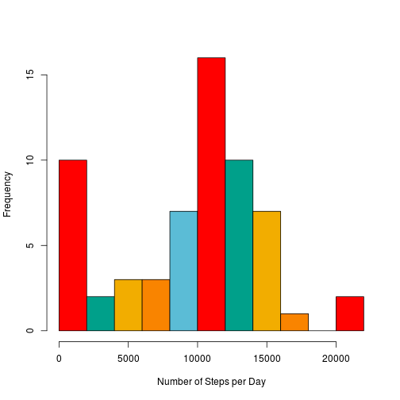
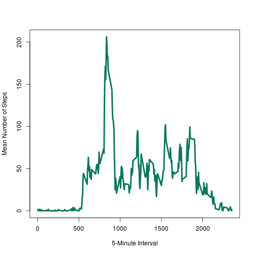
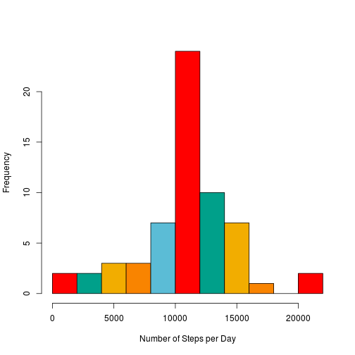
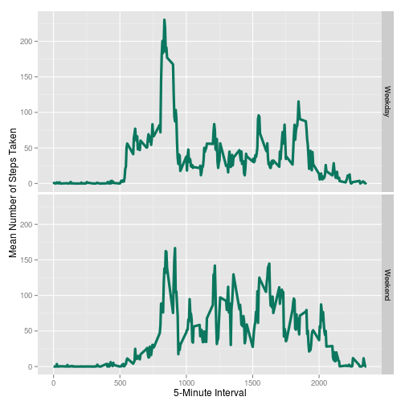

## Reproducible Research: Peer Assignment 1

This report describes an analysis of some data from a personal monitoring device, that has recorded the number of steps that an anonymous individual has taken in 5-minute intervals over two months in 2012.

## Loading and preprocessing the data

The first thing to do is load the data into R.


```r
## load required packages
library(knitr)
dat <- read.csv("activity.csv")
## check that the data loaded correctly
kable(head(dat))
```


| steps|date       | interval|
|-----:|:----------|--------:|
|    NA|2012-10-01 |        0|
|    NA|2012-10-01 |        5|
|    NA|2012-10-01 |       10|
|    NA|2012-10-01 |       15|
|    NA|2012-10-01 |       20|
|    NA|2012-10-01 |       25|

That looks ok, so we move on to the next question. 

## What is mean total number of steps taken per day?

I am going to use the package `dplyr` to do most of this data manipulation, so I will load that up first. Then I will generate a histogram for the number of steps taken per day in this data set. For those who are not familiar with `dplyr`, it is a new package for working with dataframes that is fast and flexible. One of the key functions is `group_by` which returns a dataframe indexed by the chosen grouping variables. This can then be used in conjunction with `dplyr` "verbs" such as `filter` and `summarise`. I use `summarise` a lot here&mdash;it applies a function to each dataset implied by the `group_by` indices. `%>%` is a `dplyr` operator which which takes the output from the expression on its left and 'pipes' it into the expression on its right. 


```r
library(dplyr)
library(wesanderson) ## this is just for fun (it's a palette package :)
## sum up all steps by date
steps_by_day <- dat %>% group_by(date) %>% summarise(Steps = sum(steps, na.rm = TRUE)) 
kable(head(steps_by_day))
```


|date       | Steps|
|:----------|-----:|
|2012-10-01 |     0|
|2012-10-02 |   126|
|2012-10-03 | 11352|
|2012-10-04 | 12116|
|2012-10-05 | 13294|
|2012-10-06 | 15420|

```r
## plot histogram
hist(steps_by_day$Steps, breaks = 12, col = wes.palette(5, "Darjeeling"), xlab = "Number of Steps per Day", main = "")
```

 

As one might expect, the distribution is fairly Gaussian in shape except for the spike at zero. This is probably because some of the days were all NAs and the sum function will return zero if it removes all of the values because they were all NA. The mean number of steps per day was 9354.2295 and the median was 10395. Those values were calculated using:


```r
mean(steps_by_day$Steps)
```

```
## [1] 9354
```

```r
median(steps_by_day$Steps)
```

```
## [1] 10395
```

## What is the average daily activity pattern?

Next, i will calculate the average number of steps taken in each 5-minute interval throughout the day, and plot it. 


```r
steps_per_interval <- dat %>% group_by(interval) %>% summarise(Steps = mean(steps, na.rm = TRUE))
kable(head(steps_per_interval))
```


| interval|  Steps|
|--------:|------:|
|        0| 1.7170|
|        5| 0.3396|
|       10| 0.1321|
|       15| 0.1509|
|       20| 0.0755|
|       25| 2.0943|

```r
plot(steps_per_interval$interval, steps_per_interval$Steps, type = "l", xlab = "5-Minute Interval", ylab = "Mean Number of Steps", lwd = 4, col = wes.palette(3, "Rushmore")[3])
```

 

On average, across all the days in the dataset, the 5-minute interval with the greatest number of steps was interval #835. Assuming the day starts at 12:00am the time would be at the hour 13.9167 or about 1:55pm. I found the interval with the highest average number of steps by running this:


```r
steps_per_interval$interval[which.max(steps_per_interval$Steps)]
```

```
## [1] 835
```

## Imputing missing values

The total number of missing or NA values in this dataset is: 2304. This number was obtained with the following simple code:


```r
sum(is.na(dat$steps))
```

```
## [1] 2304
```

Since missing values can introduce biases into some of our summaries, it is sometimes a good idea to try and fill these in using some technique such as interpolation. Here we will simply replace all NA values with the daily average for its 5-minute interval.


```r
## make step interval data easier to index
rownames(steps_per_interval) <- steps_per_interval$interval
## replace NA values by indexing steps_per_interval data by interval name
dat$steps[is.na(dat$steps)] <- steps_per_interval[as.character(dat$interval[is.na(dat$steps)]), "Steps"]
## check if it worked
sum(is.na(dat$steps))
```

```
## [1] 0
```

Now I can recalculate the average total steps per day to see how imputing the missing data has affected that analysis.


```r
## sum up all steps by date
steps_by_day2 <- dat %>% group_by(date) %>% summarise(Steps = sum(steps, na.rm = TRUE)) 
kable(head(steps_by_day2))
```


|date       | Steps|
|:----------|-----:|
|2012-10-01 | 10766|
|2012-10-02 |   126|
|2012-10-03 | 11352|
|2012-10-04 | 12116|
|2012-10-05 | 13294|
|2012-10-06 | 15420|

```r
## plot histogram
hist(steps_by_day2$Steps, breaks = 12, col = wes.palette(5, "Darjeeling"), xlab = "Number of Steps per Day", main = "")
```

 

As suspected, the large frequency of zeroes in the original data has disappeared, because that had been inflated by summing over days where all the values had been removed by `na.rm`. Not surprisingly this has caused the new mean, which is now 1.0766 &times; 10<sup>4</sup>, to increase over the original estimate of 9354.2295. The missing values were causing us to underestimate the number of steps taken on average in a day. The new median value of 1.0766 &times; 10<sup>4</sup> is also greater than the original of 10395, but by a much smaller margin. This is, of course, because the median is much less sensitive to outlier values such as excess zeroes generated by missing values. Since the distribution is now fairly symmetric, we expect the new mean to be close to the new median. In this case they are exactly the same, which is somewhat surprising, but certainly possible.

That mean and median values was calculated using this code:


```r
mean(steps_by_day2$Steps)
```

```
## [1] 10766
```

```r
median(steps_by_day2$Steps)
```

```
## [1] 10766
```

## Are there differences in activity patterns between weekdays and weekends?

To see if there are differences in activity patterns between weekdays and weekends, first I will add a new column to our missing value imputed dataset, saying whether the day was a weekday or a weekend.


```r
dat$weekday <- ifelse(weekdays(as.Date(dat$date)) %in% c("Saturday","Sunday"), "Weekend", "Weekday")
## how does that look?
kable(head(dat))
```


|  steps|date       | interval|weekday |
|------:|:----------|--------:|:-------|
| 1.7170|2012-10-01 |        0|Weekday |
| 0.3396|2012-10-01 |        5|Weekday |
| 0.1321|2012-10-01 |       10|Weekday |
| 0.1509|2012-10-01 |       15|Weekday |
| 0.0755|2012-10-01 |       20|Weekday |
| 2.0943|2012-10-01 |       25|Weekday |

Next I will calculate the average number of steps per time interval for weekdays and weekends seperately and then plot these in two panels, in order to compare them.


```r
steps_by_weekday <- dat %>% group_by(weekday, interval) %>% summarise(Steps = mean(steps, na.rm = TRUE))
kable(head(steps_by_weekday))
```


|weekday | interval|  Steps|
|:-------|--------:|------:|
|Weekday |        0| 2.2512|
|Weekday |        5| 0.4453|
|Weekday |       10| 0.1732|
|Weekday |       15| 0.1979|
|Weekday |       20| 0.0990|
|Weekday |       25| 1.5904|

And lastly to do the plot I will use `ggplot2`.


```r
library(ggplot2)
p <- ggplot(steps_by_weekday, aes(interval, Steps))
p <- p + geom_line(col = wes.palette(3, "Rushmore")[3], size = 1.5) + facet_grid(weekday~.) + xlab("5-Minute Interval") + ylab("Mean Number of Steps Taken")
p
```

 

It looks as if activity is more evenly spread through-out the daylight hours on the weekend, with less of a pronounced spike around lunch time, and more activity in late afternoon and evening.
